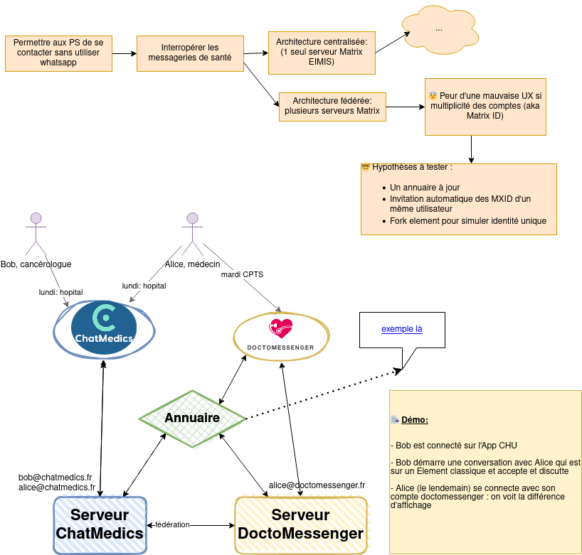

# POC décentralisé et UX

## Retours sur le POC UX en fédération dans l’hypothèse d’une architecture décentralisée [mise de côté pour le moment]

### Le problème

Pour une UX optimale, nous voulons simuler l’unicité des comptes pour les PS en situation de multi-exercice possédant plusieurs comptes de messagerie instantanée. Il s’agit de “réconcilier” leurs comptes afin qu’ils n’apparaissent qu’une fois dans l’annuaire et qu’ils puissent accéder à l’ensemble de leurs conversations depuis leurs divers outils.

### La démo

### 🧑🏻‍💻 **Dev**

- Un annuaire grâce à GRIST [https://grist.incubateur.net/o/eimis/qwe1Z66p76Tv/Annuaire-test](https://grist.incubateur.net/o/eimis/qwe1Z66p76Tv/Annuaire-test)

    - Un formulaire pour saisir les données des utilisateurs : matrix id, établissements, domaines matrix
    - Une API est disponible pour les modules synapses

- Module Synapse invitation (détecte les nouveaux membres, invite les ID liés) https://github.com/eimis-ans/synapse-auto-join-module

    - Appel de l’annuaire
    - Avec une modification Synapse pour les accusés de réception

- Module qui fait le proxy entre le front et l'annuaire (problème de CORS)
- matrix js sdk pour fusionner les membres des room si besoin.
    - POC : l’annuaire est chargé au démarrage de l’appli (à refaire avant de release)

- matrix react sdk pour modifier l'affichage :

    - Nom des rooms qui sont censés être des discussions 1 <> 1
    - Description des membres pour afficher les MXID liés

### Résultats

- De cette façon, on peut utiliser indifféremment ses 2 applis en gardant une UX convenable.
- Un PS n’apparaît qu’une seule fois dans l’annuaire.
- le protocole Matrix est respecté mais sans les modules EIMIS l’UX sera dégradée

Mise en place pour les éditeurs

- installer le module d’invitation
- utiliser les forks EIMIS des SDK dans leurs applis clientes

Autres améliorations à explorer:

- Inclure la recherche sur l’annuaire au client
- indication de l'activité du compte sur l’annuaire
- permettre à l'utilisateur de ne pas lier ses comptes
